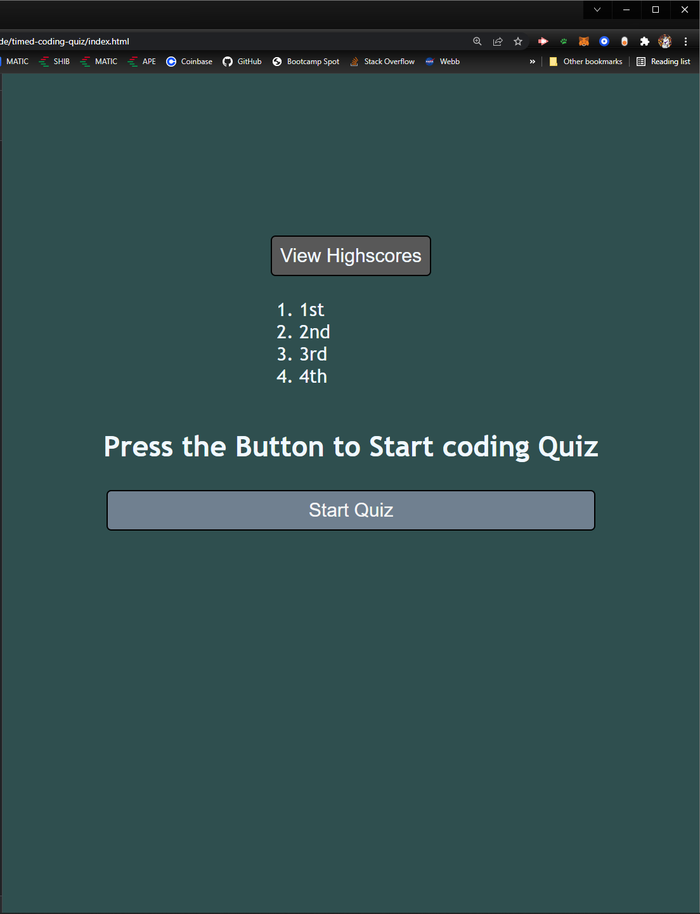
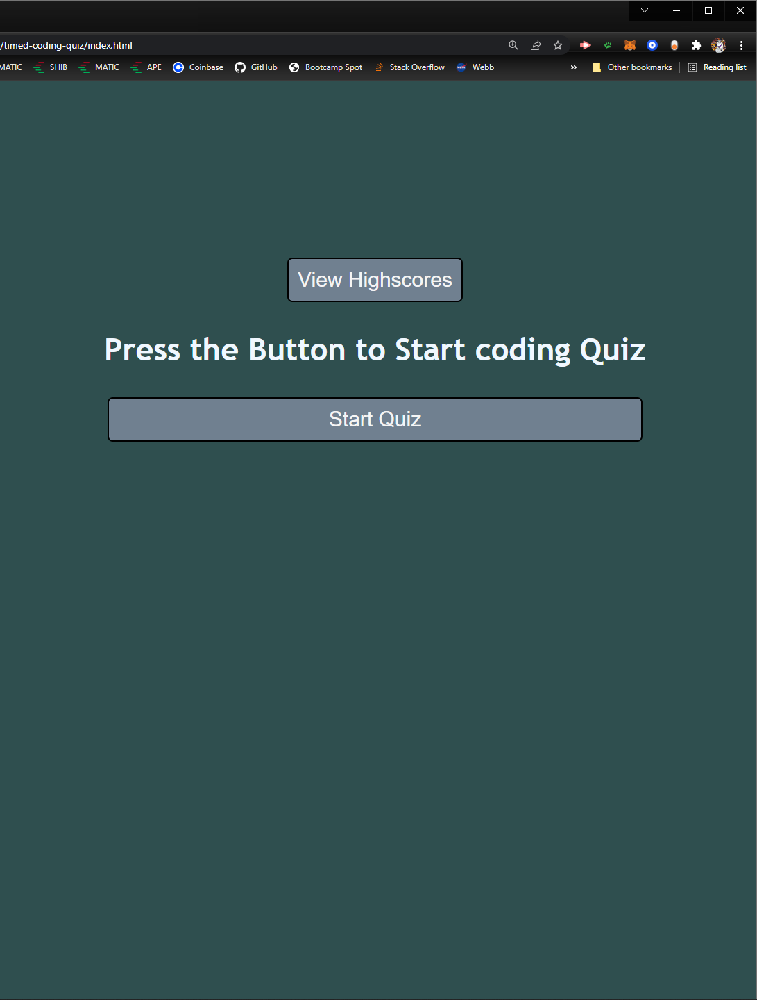
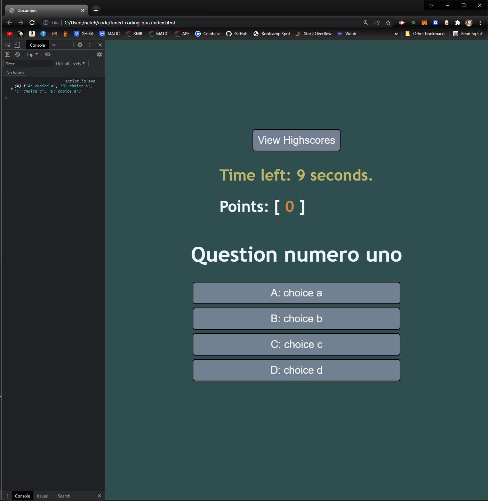
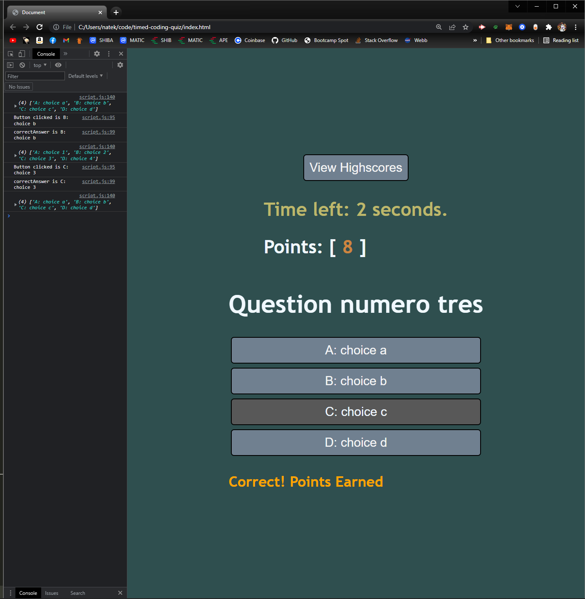
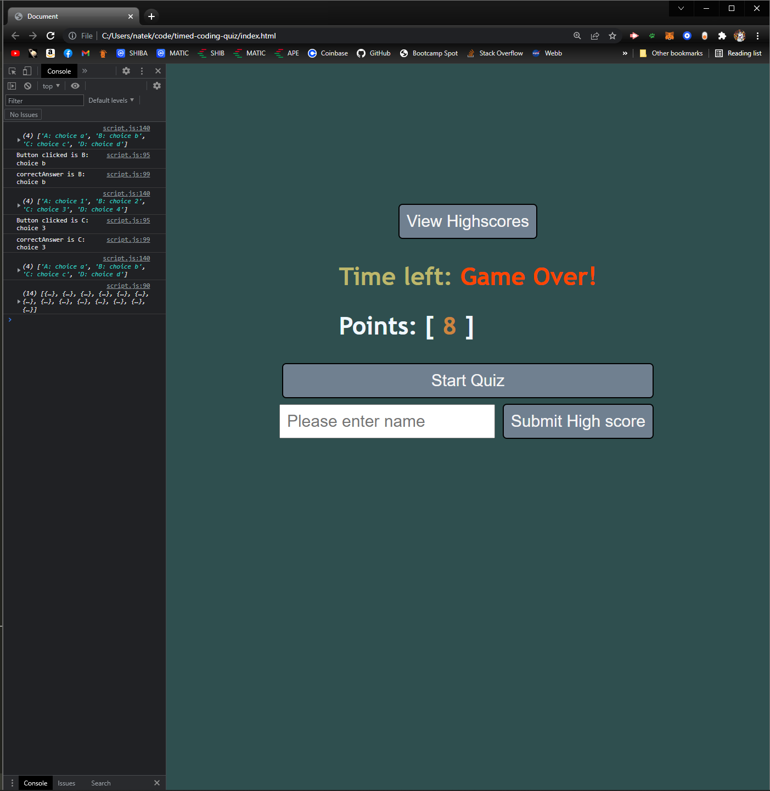
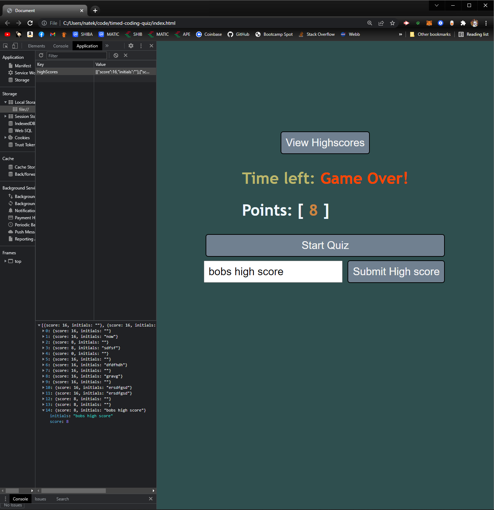

# timed-coding-quiz
in this assignment I was able to get a better understanding of functions, loops, objects and if else statements
also a chance to work with arrays a but more.
alot was covered this last week and i definetely wasnt able to retain as much of the info as i would have liked

i didnt have enough time to take the high scores that i put in local storage and apply them to the view highscore button
## website deployment
click the link provided to open web app

## links
[Git-hub-repository](https://github.com/batemanz/timed-coding-quiz.git)

[deployed-web-app](https://batemanz.github.io/timed-coding-quiz/)

## answers key for testing purposes
Q1= answer 2

Q2= answer 3

Q3= answer 1

Q4= answer 4

 you can click the view high scores button to open and collapse the high score list

 click the start quiz button to start the quiz

 after quiz has started timer starts count down

 select from 1 of 4 button options

 at the end of quiz you can submit your name and high score

